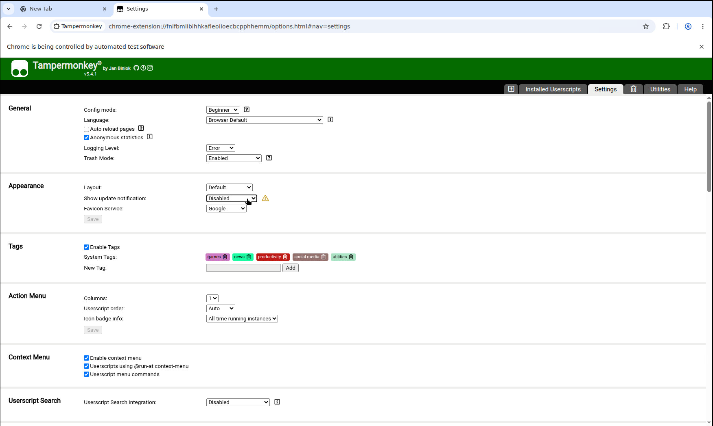

# headful-chrome-remote-puppeteer

This image uses a 1750x1050 screen resolution by default (because this is my computer screen size).

If you need to modify it, please modify line 11 of `entrypoint.sh` and line 14 of `index.js`.

Note: Do not delete line 20 of index.js.

Combined with `restart: unless-stopped`, this will achieve the effect of automatically restarting the browser after an error or crash.

If you need to save login information (such as cookies), uncomment line 6 of both index.js and entrypoint.sh (make sure the paths are consistent).

You can use WebGL.

VNC screen listener: `0.0.0.0:5900`

Username: `123`

Password: `12345678`

Browser remote debugging listener: `0.0.0.0:9223`

Node.js remote debugging listener: `0.0.0.0:9229`

## How to use

```bash
git clone git@github.com:JuTemp/headful-chrome-remote-puppeteer.git
cd headful-chrome-remote-puppeteer
docker compose up -d
```

## Note

If you are using `dae`, try `network_mode: host`.

Please do not use `volumes: ./:/app` unless you want to overwrite `$HOME/.vnc/passwd`.

## Use extension

View the `index-extension.js` file.

For example, how to use Tampermonkey, especially how to ensure the plugin persists after a restart.

Download CRX file [tampermonkey_stable.crx](https://www.tampermonkey.net/crx/tampermonkey_stable.crx) from its homepage [tampermonkey.net](https://www.tampermonkey.net/).

`unzip` the CRX file in the `/app/tampermonkey_stable` folder, making sure `/app/tampermonkey_stable/manifest.json` exists.

Adding `pipe: true, enableExtensions: ["/app/tampermonkey_stable"]`, and then it works.

You can configure Tampermonkey like this below.


